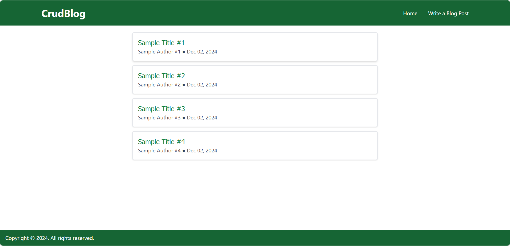
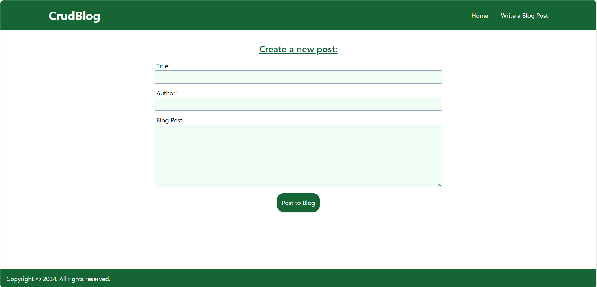
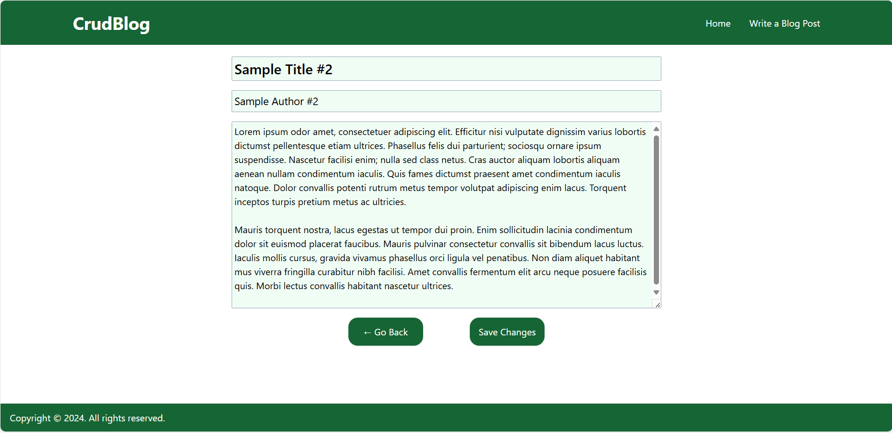

# CRUD Blog Application

A simple blog application with CRUD operations created using React and Express as part of job training. It can be run on your local machine, where you can create, read, update, and delete posts on the blog.

## Clone the Repository

To get a copy of the repository on your local machine, open your terminal and run the following command:

```
git clone https://github.com/akivaab/training-node-express.git
```

Or, you can download the ZIP file from the GitHub page.

## Running the Project

Once you’ve cloned or downloaded the repository, navigate to the root directory of the repository in the terminal. Then enter the following commands:

```
cd server
npm install
npm run dev
cd ../client
npm install
npm run dev
```

Click on the provided link to open the project on a port of your local machine.

## Overview

The home page features a list of all the articles currently posted on the blog. This page can be accessed at any time by clicking "Home" towards the top-right of the screen in the header.



### Create

A new post can be written for the blog by clicking "Write a Blog Post" at the top-right of the screen in the header. This will bring you to a page where you can write and submit the post.



### Read

To read a post, simply click on a post from the list on the home screen.


### Update

To update a post, click the button labeled "Edit Post" [(see above screenshot)](#read) to switch from reading mode to editing mode. When you finish editing, click "Save Changes".



### Delete

To delete a post, click the button labeled "Delete Post" [(see above screenshot)](#read).
